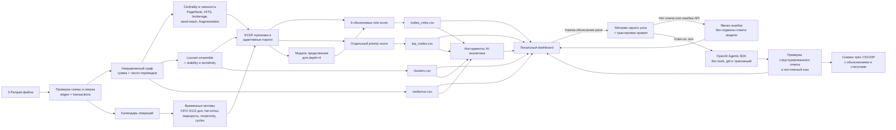

# Архитектура решения «Граф денег»

## Границы интерпретации

- Роль — проверяемая структурная гипотеза, а не утверждение о виновности.
- `role_score` выражает устойчивость и наблюдаемость выбранной роли; `priority_score` — порядок аналитической проверки. Эти величины намеренно не смешиваются.
- Для `depth=4` отсутствие исходящего ребра правоцензурировано. Интерфейс показывает `p_continue` и снижает уверенность terminal-гипотезы.
- Louvain использует симметризованную проекцию только для кластеризации. Направление сохраняется в признаках, правилах ролей, временных мотивах и визуальном графе.
- Исходные файлы и расчёт ролей остаются локально. LLM не нужен для расчёта результатов.
- По кнопке объяснения и при настроенном ключе в OpenAI передаются метрики одного выбранного узла и правила решения. Идентификаторы и журнал транзакций исключены, tracing отключён. Ответ не изменяет рассчитанную роль.
- Пакетная генерация запускается отдельно после подтверждения платных запросов; есть остановка и продолжение. Проверенные ответы попадают в скачиваемые снимки CSV, исходные результаты pipeline не перезаписываются. Без ключа и при ошибке API источник и статус показывают отсутствие ответа; общий локальный чат продолжает работать без API.
